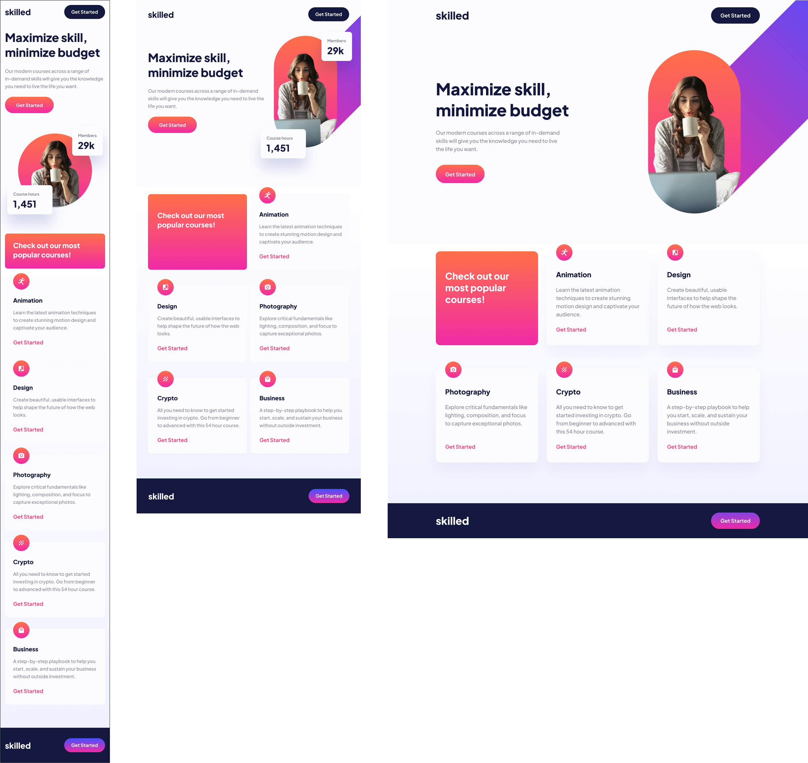

# Elearning Landing Page-CSS Responsive

Este es mi primer proyecto responsive, en el cual he utilizado **Vite** como herramienta de desarrollo para optimizar el proceso. En este proyecto, he creado una web adaptable a **móvil**, **tablet** y **desktop**, asegurando que el diseño se ajuste de manera correcta a diferentes tamaños de pantalla.

### Tecnologías utilizadas
- HTML5
- CSS3
- SASS
- Vite

### Características
Diseño responsive que se adapta a diferentes dispositivos.
Estructura optimizada para rendimiento.
Estilos y componentes organizados utilizando SASS para un mejor manejo del CSS.
